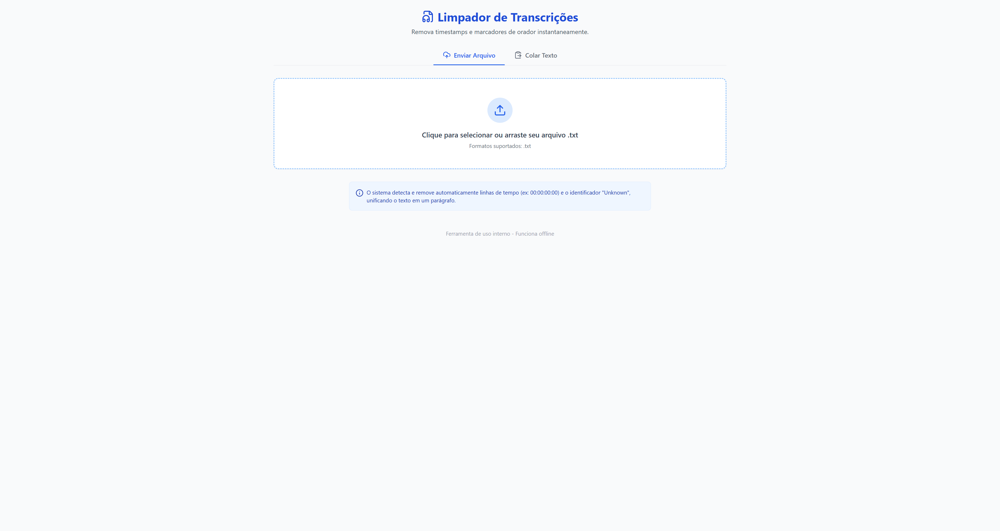
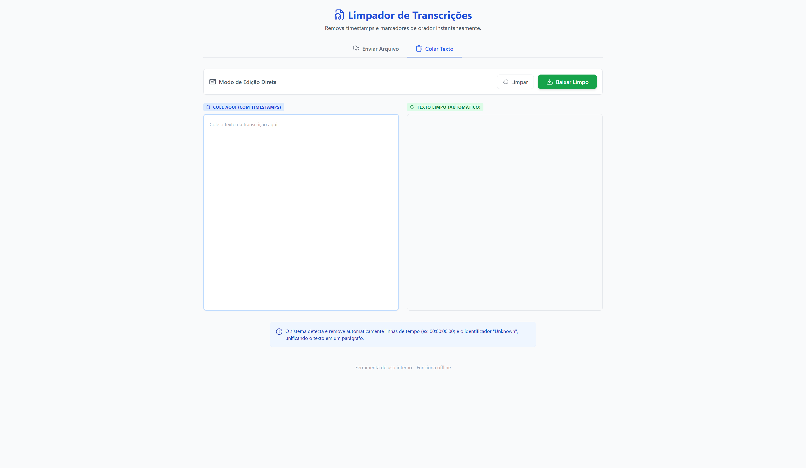

# Limpador de Transcrições



## 📋 Sobre o Projeto

O **Limpador de Transcrições** é uma ferramenta web simples e eficiente projetada para processar e limpar transcrições brutas. Ele remove automaticamente timestamps, marcadores de oradores desconhecidos e formata o texto para leitura fluida, transformando listas de falas com tempo em parágrafos de texto corrido.

## ✨ Funcionalidades Principais

- **Limpeza Inteligente de Timestamps**: Detecta e remove padrões de tempo (ex: `00:00:00:00 - 00:00:10:00`) automaticamente.
- **Filtragem de Oradores**: Remove linhas contendo apenas "Unknown" ou marcadores irrelevantes.
- **Unificação de Texto**: Concatena as falas em um texto corrido, removendo quebras de linha excessivas.
- **Dois Modos de Operação**:
  - **Upload de Arquivo**: Arraste e solte ou selecione arquivos `.txt`.
  - **Colar Texto**: Área para colar trechos rápidos da área de transferência.
- **Comparação em Tempo Real**: Visualize o original e o resultado lado a lado.
- **Download Fácil**: Exporte o texto limpo como um novo arquivo `.txt`.
- **Interface Moderna**: Design limpo e responsivo utilizando Tailwind CSS e ícones Lucide.

## 📸 Visualização



## 🚀 Como Clonar e Rodar

Como este projeto é construído com tecnologias web estáticas (HTML, CSS e JS), ele é extremamente simples de executar.

### Pré-requisitos

- Git instalado
- Navegador Web moderno com acesso à internet (para carregar o Tailwind CSS e Lucide Icons via CDN)

### Passo a Passo

1. **Clone o repositório**
   Abra seu terminal e execute:

   ```bash
   git clone https://github.com/olivpeter/limpa-transcript.git
   ```

2. **Acesse o diretório**

   ```bash
   cd limpa-transcript
   ```

3. **Execute o projeto**
   Você pode abrir o arquivo `index.html` diretamente no seu navegador:
   - No Windows: Dê um duplo clique em `index.html` ou execute `start index.html` no terminal.
   - Alternativamente, arraste o arquivo para uma nova aba do seu navegador.

## 🛠️ Tecnologias Utilizadas

- **HTML5**: Estrutura semântica.
- **CSS3 (Tailwind CSS)**: Estilização rápida e responsiva via CDN.
- **JavaScript (Vanilla)**: Lógica de processamento de texto e manipulação do DOM.
- **Lucide Icons**: Biblioteca de ícones leve e moderna.

## 📝 Licença

Este projeto está sob a licença MIT. Veja o arquivo [LICENSE](LICENSE) para mais detalhes.
